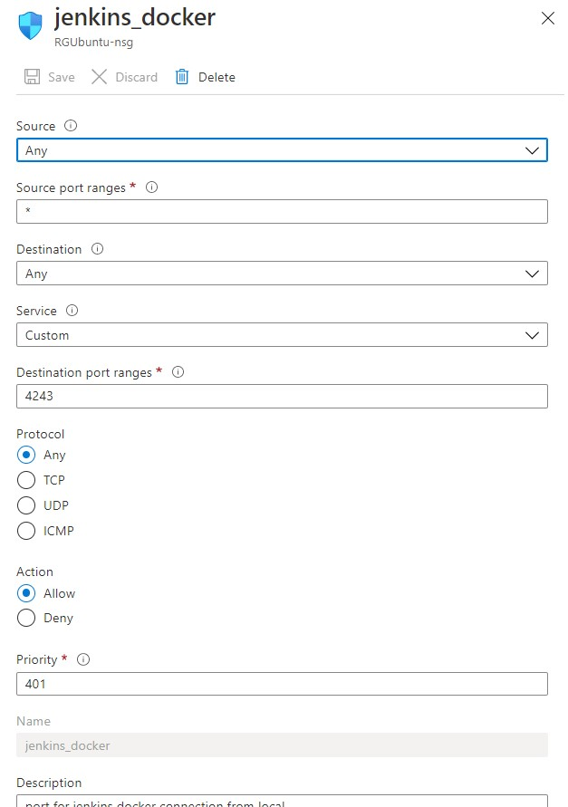
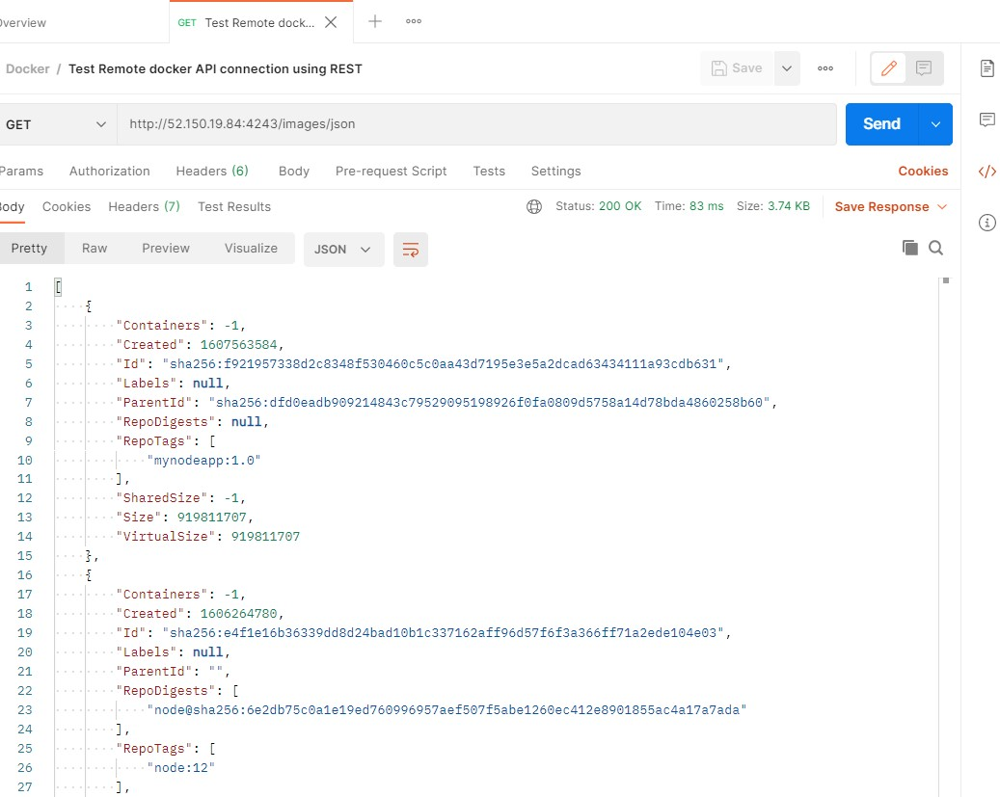
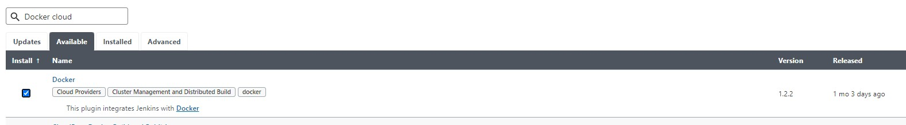
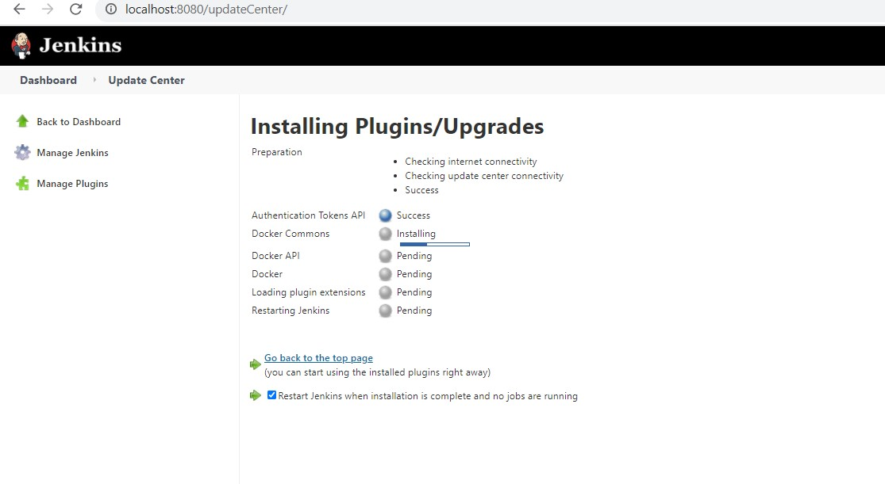
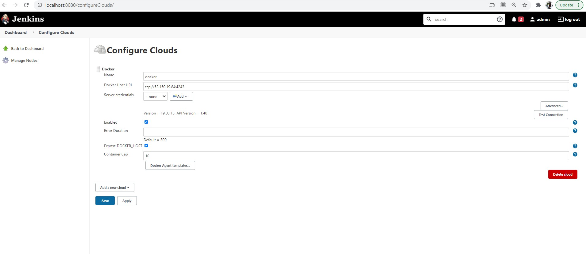
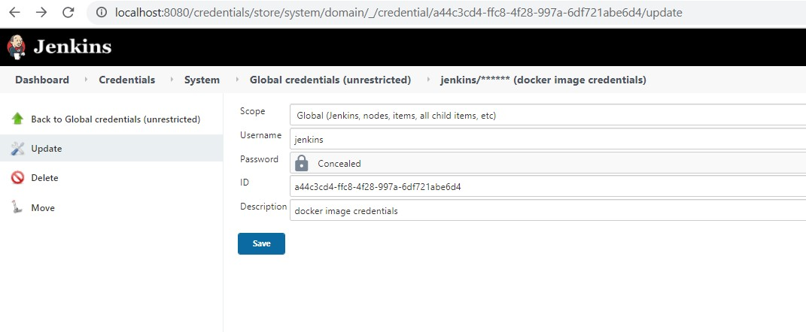
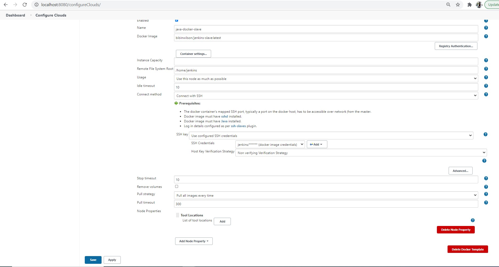
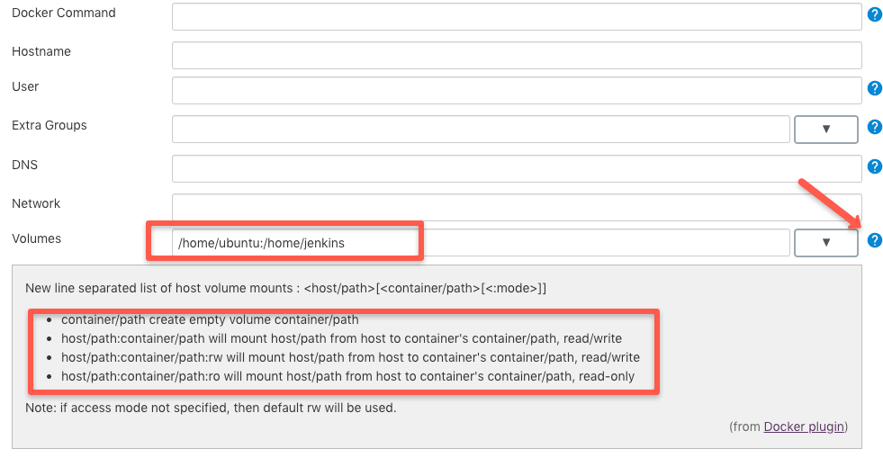
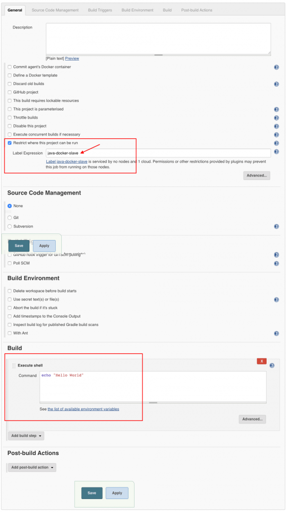
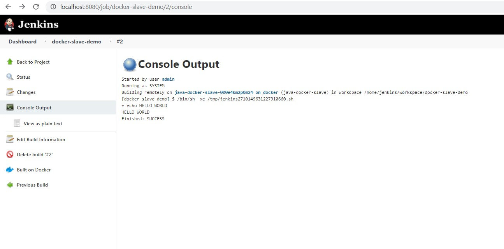

## (2) Configure Azure VM as Docker slave

###### Refernce: https://devopscube.com/docker-containers-as-build-slaves-jenkins/

- install jenkins on windows as per notes/1.0.0_install_jenkins_windows.md

- add necessary firewall rules for your VM to accept connection on port 4243



- Open Remote docker API connection as per following: https://scriptcrunch.com/enable-docker-remote-api/
- open following file: /lib/systemd/system/docker.service and modify following line:

```
ExecStart=/usr/bin/dockerd -H tcp://0.0.0.0:4243 -H unix:///var/run/docker.sock
```

- restart Docker service

```
root@krb5:~# sudo systemctl daemon-reload
root@krb5:~# sudo service docker restart
root@krb5:~# docker version
Client: Docker Engine - Community
 Version:           19.03.13
 API version:       1.40
 Go version:        go1.13.15
 Git commit:        4484c46d9d
 Built:             Wed Sep 16 17:02:36 2020
 OS/Arch:           linux/amd64
 Experimental:      false

Server: Docker Engine - Community
 Engine:
  Version:          19.03.13
  API version:      1.40 (minimum version 1.12)
  Go version:       go1.13.15
  Git commit:       4484c46d9d
  Built:            Wed Sep 16 17:01:06 2020
  OS/Arch:          linux/amd64
  Experimental:     false
 containerd:
  Version:          1.3.7
  GitCommit:        8fba4e9a7d01810a393d5d25a3621dc101981175
 runc:
  Version:          1.0.0-rc10
  GitCommit:        dc9208a3303feef5b3839f4323d9beb36df0a9dd
 docker-init:
  Version:          0.18.0
  GitCommit:        fec3683

```

- Test from windows machine if remote Docker API connection is working: curl http://52.150.19.84:4243/version

```
C:\Users\offic>curl http://52.150.19.84:4243/version
{"Platform":{"Name":"Docker Engine - Community"},"Components":[{"Name":"Engine","Version":"19.03.13","Details":{"ApiVersion":"1.40","Arch":"amd64","BuildTime":"2020-09-16T17:01:06.000000000+00:00","Experimental":"false","GitCommit":"4484c46d9d","GoVersion":"go1.13.15","KernelVersion":"5.4.0-1039-azure","MinAPIVersion":"1.12","Os":"linux"}},{"Name":"containerd","Version":"1.3.7","Details":{"GitCommit":"8fba4e9a7d01810a393d5d25a3621dc101981175"}},{"Name":"runc","Version":"1.0.0-rc10","Details":{"GitCommit":"dc9208a3303feef5b3839f4323d9beb36df0a9dd"}},{"Name":"docker-init","Version":"0.18.0","Details":{"GitCommit":"fec3683"}}],"Version":"19.03.13","ApiVersion":"1.40","MinAPIVersion":"1.12","GitCommit":"4484c46d9d","GoVersion":"go1.13.15","Os":"linux","Arch":"amd64","KernelVersion":"5.4.0-1039-azure","BuildTime":"2020-09-16T17:01:06.000000000+00:00"}

C:\Users\offic>
```

- Test remote Docker API connection using REST client:

```
curl --location --request GET 'http://52.150.19.84:4243/images/json'
```

- OR using POSTMAN as follows: 



- Next we will configure Jenkins to use this Docker agent
- Step 1: Head over to Jenkins Dashboard –> Manage Jenkins –> Manage Plugins.

- Step 2: Under the Available tab, search for “Docker” and install the docker cloud plugin and restart Jenkins. Here is the official plugin site. Make
  sure you install the right plugin as shown below





- Step 3: Once installed, head over to Jenkins Dashboard –> Manage Jenkins –>Configure system : http://localhost:8080/configureClouds/

- Step 4: Under “Configure System”, if you scroll down, there will be a section named “cloud” at the last. There you can fill out the docker host
  parameters for spinning up the slaves.

- Step 5: Under docker, you need to fill out the details as shown in the image below.

Note: Replace “Docker URI” with your docker host IP. For example, tcp://52.150.19.84:4243 You can use the “Test connection” to test if Jenkins is able to connect to the Docker host.




- Build Docker image and run container using notes/2.0.2_create_Jenkins_docker_Container.md.  
  
- Alternatively can use bibinwilson/jenkins-slave:latest ( password is jenkins/jenkins)




- Step 6: Now, from “Docker Agent Template” dropdown, click the “Add Docker template” and fill in the details based on the explanation and the image given below and save the configuration.

1. Labels – Identification for the docker host. It will be used in the Job configuration. Here we usejava-docker-slave
1. Name: Name of the docker template. Here we use the same name as label ie, java-docker-slave
1. Docker Image –bibinwilson/jenkins-slave:latest or the image that you created for the slave.
1. Remote Filing System Root – Home folder for the user you have created. In our case, it’s /home/jenkins
1. Credentials – click add and enter the SSH username and password that you have created for the docker image. Leave the rest of the configuration as shown in the image below and click save. If you are using my Docker image, the user will be jenkins & password is also jenkins.: 





- By default, the workspace will not be persisted in the host. However, if you want the workspace to be persistent, add a host volume path under container settings.

- For example, if you want the workspace to be available at /home/ubuntu, you can add the volume path as shown below./home/jenkins is the path inside the container.
```
/home/ubuntu:/home/jenkins
Towards the right of the Volumes option, if you click the question mark, it will show you additional volume options as shown below.
```



- Now that you have the slave configurations ready,
- Create a freestyle job, select “Restrict where this project can be run” option and select the docker host as a slave using the label. Add a shell
build step which echoes a simple “Hello World“




- If you have done all the configurations right, Jenkins will spin up a container, builds the project and destroys the container once the build is done.

- First you will see a pending notification as Jenkins tries to deploy a container on run time and establishes an SSH connection. After a few seconds, your job will start building.




* Logs for Build can be found here http://localhost:8080/log/all or **Manage Jenkins -> System Logs** for troubleshooting purpose 


```
Provisioning 'bibinwilson/jenkins-slave:latest' on 'docker'; Total containers: 0 (of 10)
Feb 27, 2021 10:52:44 PM INFO com.nirima.jenkins.plugins.docker.DockerCloud provision
Will provision 'bibinwilson/jenkins-slave:latest', for label: 'java-docker-slave', in cloud: 'docker'
Feb 27, 2021 10:52:44 PM INFO hudson.slaves.NodeProvisioner$StandardStrategyImpl apply
Started provisioning Image of bibinwilson/jenkins-slave:latest from docker with 1 executors. Remaining excess workload: 0
Feb 27, 2021 10:52:44 PM INFO com.nirima.jenkins.plugins.docker.DockerTemplate pullImage
Pulling image 'bibinwilson/jenkins-slave:latest'. This may take awhile...
Feb 27, 2021 10:52:44 PM INFO io.jenkins.docker.client.DockerAPI getOrMakeClient
Cached connection io.jenkins.docker.client.DockerAPI$SharableDockerClient@48922179 to DockerClientParameters{dockerUri=tcp://52.150.19.84:4243, credentialsId=null, readTimeoutInMsOrNull=300000, connectTimeoutInMsOrNull=60000}
Feb 27, 2021 10:52:44 PM INFO com.nirima.jenkins.plugins.docker.DockerTemplate pullImage
Finished pulling image 'bibinwilson/jenkins-slave:latest', took 234 ms
Feb 27, 2021 10:52:44 PM INFO com.nirima.jenkins.plugins.docker.DockerTemplate doProvisionNode
Trying to run container for image "bibinwilson/jenkins-slave:latest"
Feb 27, 2021 10:52:44 PM INFO com.nirima.jenkins.plugins.docker.DockerTemplate doProvisionNode
Trying to run container for node java-docker-slave-000e4zfsxs3f0 from image: bibinwilson/jenkins-slave:latest
Feb 27, 2021 10:52:45 PM INFO com.nirima.jenkins.plugins.docker.DockerTemplate doProvisionNode
Started container ID 2a4fe031bc8fbdd02eae821488cd35edf475b631ece40e83488261b2c885fad0 for node java-docker-slave-000e4zfsxs3f0 from image: bibinwilson/jenkins-slave:latest
Feb 27, 2021 10:52:46 PM INFO com.nirima.jenkins.plugins.docker.utils.PortUtils$ConnectionCheckSSH executeOnce
SSH port is open on 52.150.19.84:32785
Feb 27, 2021 10:52:46 PM WARNING hudson.plugins.sshslaves.JavaVersionChecker resolveJava
Java is not in the PATH nor configured with the javaPath setting, Jenkins will try to guess where is Java,this guess will be remove in the future.
Feb 27, 2021 10:52:52 PM INFO hudson.slaves.NodeProvisioner lambda$update$6
Image of bibinwilson/jenkins-slave:latest provisioning successfully completed. We have now 3 computer(s)
Feb 27, 2021 10:53:17 PM INFO io.jenkins.docker.DockerTransientNode$1 println
Disconnected computer for node 'java-docker-slave-000e4zfsxs3f0'.
Feb 27, 2021 10:53:18 PM INFO io.jenkins.docker.DockerTransientNode$1 println
Removed Node for node 'java-docker-slave-000e4zfsxs3f0'.
Feb 27, 2021 10:53:18 PM INFO hudson.model.AsyncPeriodicWork lambda$doRun$0
Started DockerContainerWatchdog Asynchronous Periodic Work
Feb 27, 2021 10:53:18 PM INFO com.nirima.jenkins.plugins.docker.DockerContainerWatchdog execute
Docker Container Watchdog has been triggered
Feb 27, 2021 10:53:18 PM INFO com.nirima.jenkins.plugins.docker.DockerContainerWatchdog$Statistics writeStatisticsToLog
Watchdog Statistics: Number of overall executions: 32, Executions with processing timeout: 0, Containers removed gracefully: 10, Containers removed with force: 0, Containers removal failed: 0, Nodes removed successfully: 1, Nodes removal failed: 0, Container removal average duration (gracefully): 535 ms, Container removal average duration (force): 0 ms, Average overall runtime of watchdog: 245 ms, Average runtime of container retrieval: 77 ms
Feb 27, 2021 10:53:18 PM INFO com.nirima.jenkins.plugins.docker.DockerContainerWatchdog loadNodeMap
We currently have 1 nodes assigned to this Jenkins instance, which we will check
Feb 27, 2021 10:53:18 PM INFO com.nirima.jenkins.plugins.docker.DockerContainerWatchdog execute
Checking Docker Cloud docker at tcp://52.150.19.84:4243
Feb 27, 2021 10:53:18 PM INFO com.nirima.jenkins.plugins.docker.DockerContainerWatchdog execute
Docker Container Watchdog check has been completed
Feb 27, 2021 10:53:18 PM INFO hudson.model.AsyncPeriodicWork lambda$doRun$0
Finished DockerContainerWatchdog Asynchronous Periodic Work. 61 ms
Feb 27, 2021 10:53:19 PM INFO io.jenkins.docker.DockerTransientNode$1 println
Stopped container '2a4fe031bc8fbdd02eae821488cd35edf475b631ece40e83488261b2c885fad0' for node 'java-docker-slave-000e4zfsxs3f0'.
Feb 27, 2021 10:53:19 PM INFO io.jenkins.docker.DockerTransientNode$1 println
Removed container '2a4fe031bc8fbdd02eae821488cd35edf475b631ece40e83488261b2c885fad0' for node 'java-docker-slave-000e4zfsxs3f0'.
```
