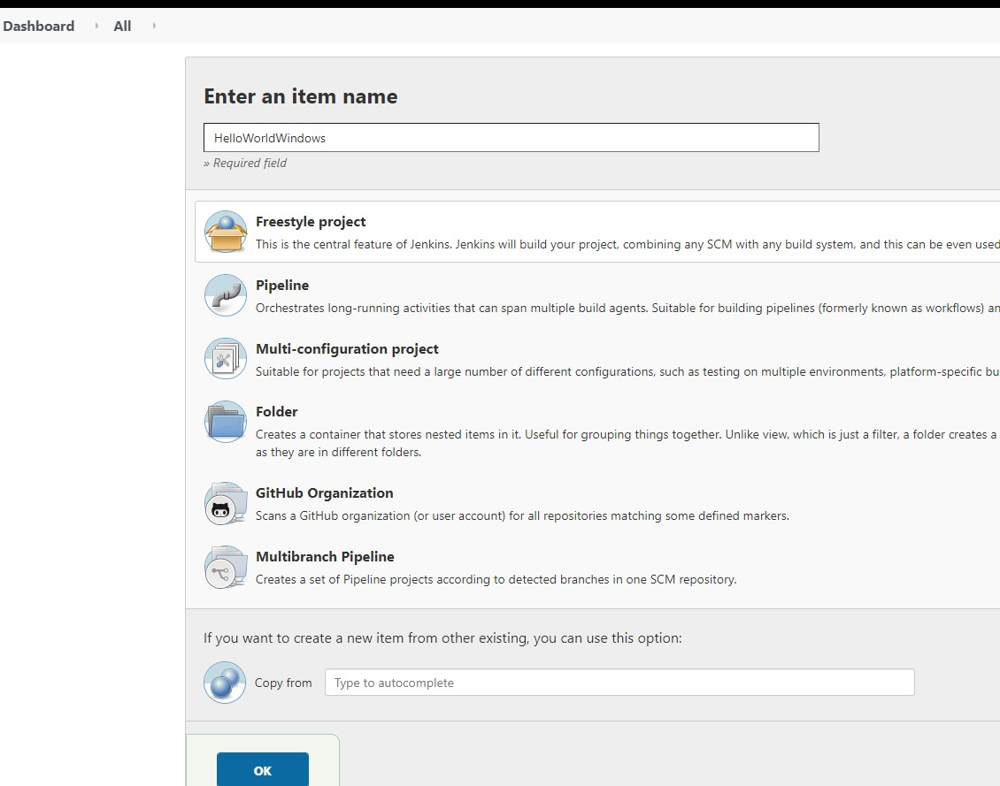
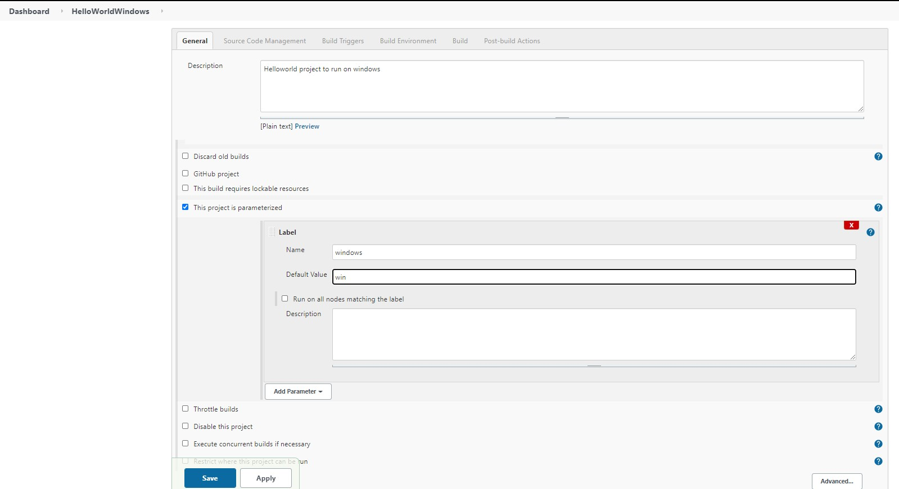
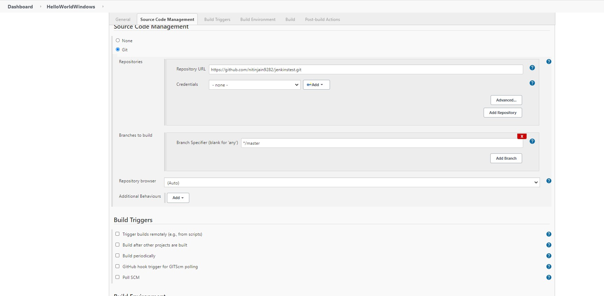
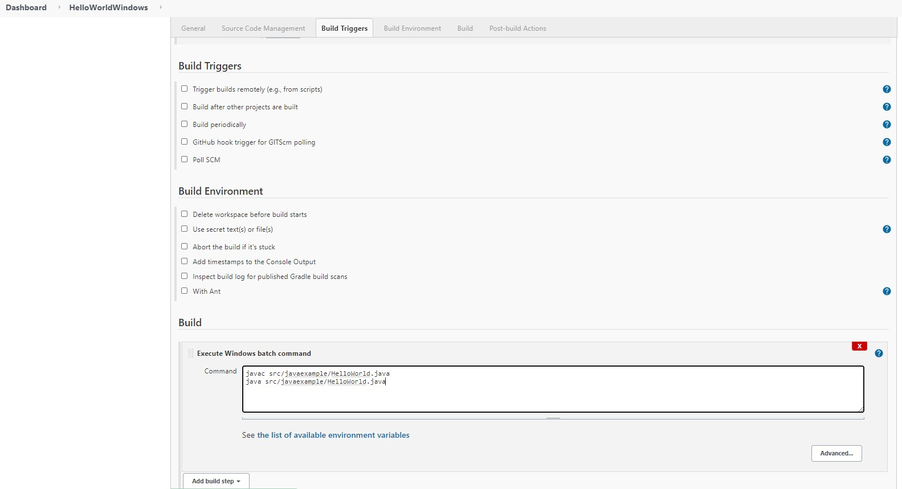
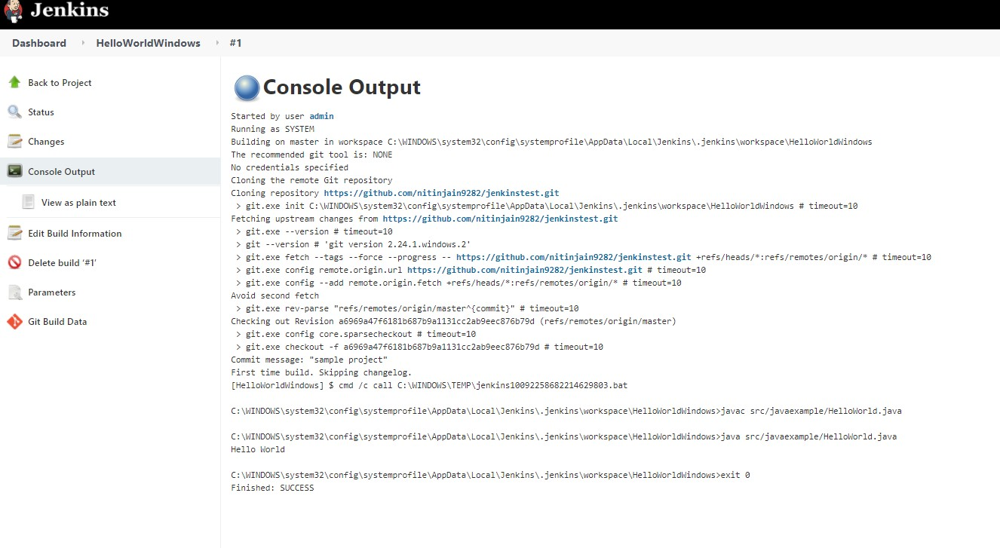

### Run sample freestyle project build on windows master agent

1. # Use sample Java project here: https://github.com/nitinjain9282/jenkinstest.git
2. http://localhost:8080/ , Manage Jenkins => Manage Plugin => install following plugin: https://plugins.jenkins.io/nodelabelparameter/
3. 
4. #### configure Jenkins job

5. 

