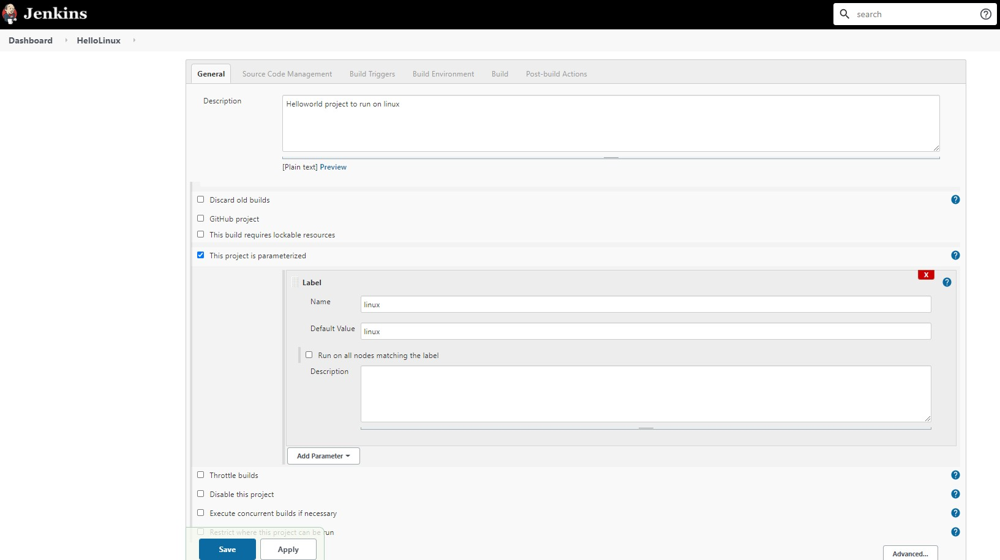
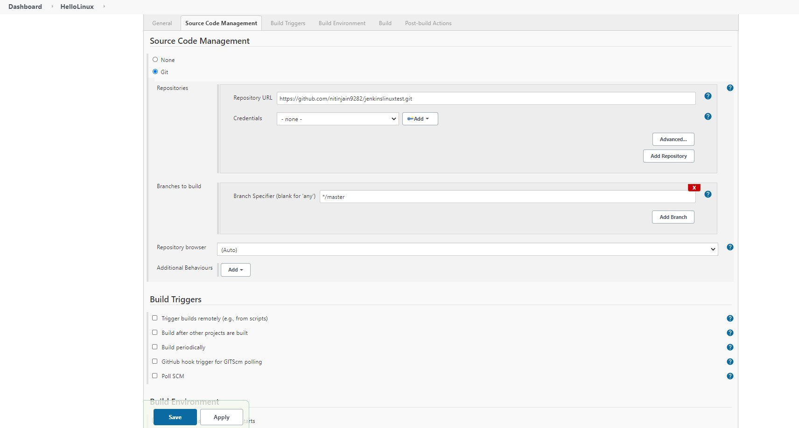
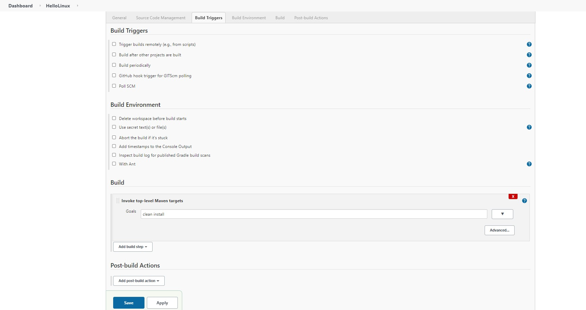
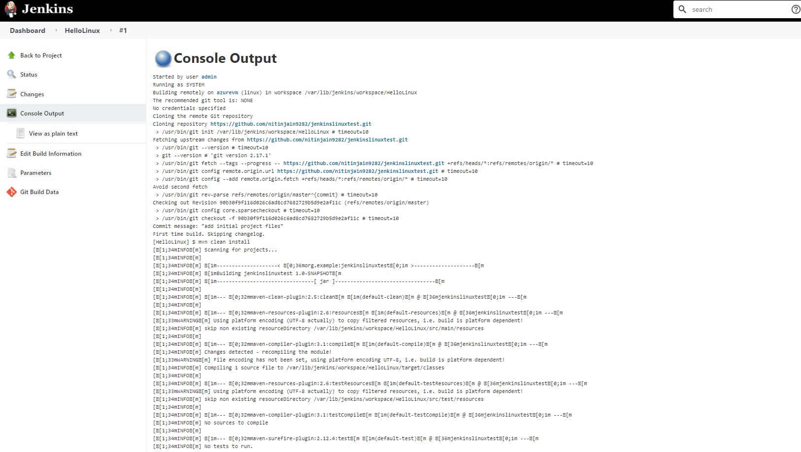

### Run sample freestyle project build on linux master agent

1. # Use sample Java project here: https://github.com/nitinjain9282/jenkinslinuxtest.git
2. http://localhost:8080/ , Manage Jenkins => Manage Plugin => install following plugin: https://plugins.jenkins.io/nodelabelparameter/
3. Make sure linux label is already applied to node. 
4. Make sure Maven is installed on node

#### configure porject
6. 
7. 
8.  

9. 
