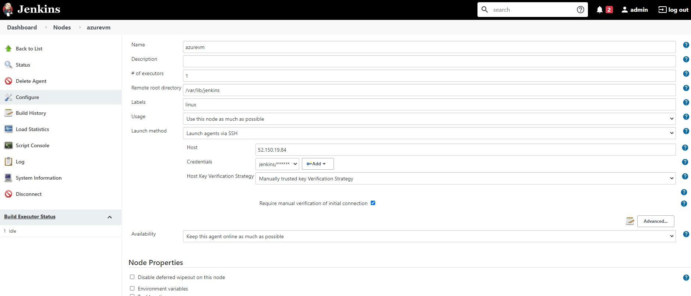
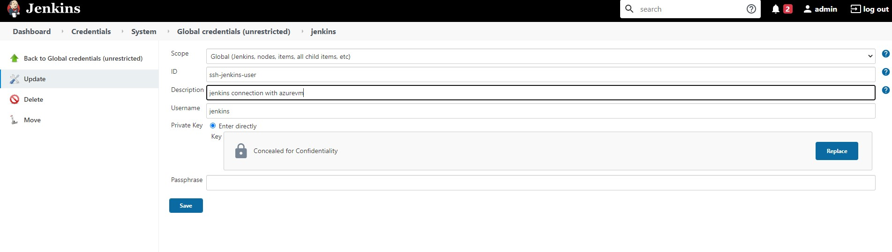
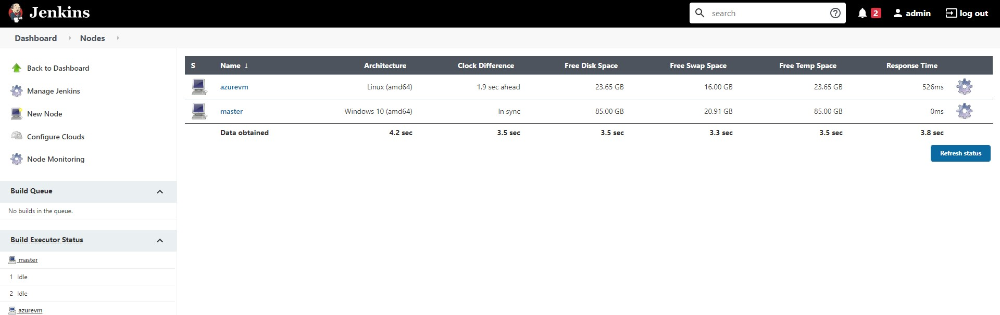

## (2) Configure Azure VM as slave

###### help links:  
https://ghanshammahajan.com/how-to-add-a-swap-space-in-linux-azure-virtual-machines/
https://yallalabs.com/devops/how-to-add-linux-slave-node-agent-node-jenkins/

1.  login to VM as root
2.  mkdir -p /cs/devtooling/jenkins/ws
3.  mkdir -p /var/lib/jenkins
4.  sudo useradd -d /var/lib/jenkins jenkins , passwd jenkins , keep it as jenkins/jenkins
5.  chown jenkins:jenkins /var/lib/jenkins
6.  chmod -R 775 /var/lib/jenkins
7.  install following packages on ubuntu azure vm: sudo apt-get install openjdk-8-jdk
8.  generate ssh key as follows: 

```
root@krb5:/var/lib# su - jenkins
jenkins@krb5:~$  ssh-keygen -t rsa -C "Jenkins agent key"
Generating public/private rsa key pair.
Enter file in which to save the key (/var/lib/jenkins/.ssh/id_rsa):
Created directory '/var/lib/jenkins/.ssh'.
Enter passphrase (empty for no passphrase):
Enter same passphrase again:
Your identification has been saved in /var/lib/jenkins/.ssh/id_rsa.
Your public key has been saved in /var/lib/jenkins/.ssh/id_rsa.pub.
The key fingerprint is:
SHA256:MQGkjmE74nV87SUEk7eMfj0unrRiW0QEZW2TQpjl8go Jenkins agent key
The key's randomart image is:
+---[RSA 2048]----+
|     .o=X*. .    |
|     . +*+ =     |
|  o .  .*++ .    |
| . =.  .*=       |
|. +..E..S=..     |
|..... o.+.oo     |
| .     ..+. .    |
|       oo.o.     |
|      ..++.      |
+----[SHA256]-----+
jenkins@krb5:~$

```

9.  Manage Jenkins ==> Manage Node ==> New Node ==> azurevm
10. configure Jenkins as follows: 
    
11. Configure credentials as follows: configure Jenkins as follows: 


12. Log output: 
```
SSHLauncher{host='52.150.19.84', port=22, credentialsId='e1e2a166-92ae-455c-8603-c8f8f8a63810', jvmOptions='', javaPath='', prefixStartSlaveCmd='', suffixStartSlaveCmd='', launchTimeoutSeconds=60, maxNumRetries=10, retryWaitTime=15, sshHostKeyVerificationStrategy=hudson.plugins.sshslaves.verifiers.ManuallyTrustedKeyVerificationStrategy, tcpNoDelay=true, trackCredentials=true}
[02/20/21 19:00:00] [SSH] Opening SSH connection to 52.150.19.84:22.
[02/20/21 19:00:00] [SSH] SSH host key matches key seen previously for this host. Connection will be allowed.
[02/20/21 19:00:00] [SSH] Authentication successful.
[02/20/21 19:00:01] [SSH] The remote user's environment is:
BASH=/bin/bash
BASHOPTS=cmdhist:complete_fullquote:extquote:force_fignore:hostcomplete:interactive_comments:progcomp:promptvars:sourcepath
BASH_ALIASES=()
BASH_ARGC=()
BASH_ARGV=()
BASH_CMDS=()
BASH_EXECUTION_STRING=set
BASH_LINENO=()
BASH_SOURCE=()
BASH_VERSINFO=([0]="4" [1]="4" [2]="20" [3]="1" [4]="release" [5]="x86_64-pc-linux-gnu")
BASH_VERSION='4.4.20(1)-release'
DIRSTACK=()
EUID=1002
GROUPS=()
HOME=/var/lib/jenkins
HOSTNAME=krb5.ahmad.io
HOSTTYPE=x86_64
IFS=$' \t\n'
LANG=C.UTF-8
LOGNAME=jenkins
MACHTYPE=x86_64-pc-linux-gnu
MAIL=/var/mail/jenkins
OPTERR=1
OPTIND=1
OSTYPE=linux-gnu
PATH=/usr/local/sbin:/usr/local/bin:/usr/sbin:/usr/bin:/sbin:/bin:/usr/games:/usr/local/games:/snap/bin
PIPESTATUS=([0]="0")
PPID=27555
PS4='+ '
PWD=/var/lib/jenkins
SHELL=/bin/bash
SHELLOPTS=braceexpand:hashall:interactive-comments
SHLVL=1
SSH_CLIENT='98.122.144.245 55427 22'
SSH_CONNECTION='98.122.144.245 55427 10.0.0.4 22'
TERM=dumb
UID=1002
USER=jenkins
XDG_RUNTIME_DIR=/run/user/1002
XDG_SESSION_ID=12
_=']'
[02/20/21 19:00:01] [SSH] Checking java version of /var/lib/jenkins/jdk/bin/java
Couldn't figure out the Java version of /var/lib/jenkins/jdk/bin/java
bash: /var/lib/jenkins/jdk/bin/java: No such file or directory

[02/20/21 19:00:01] [SSH] Checking java version of java
[02/20/21 19:00:01] [SSH] java -version returned 1.8.0_282.
[02/20/21 19:00:01] [SSH] Starting sftp client.
[02/20/21 19:00:02] [SSH] Copying latest remoting.jar...
Source agent hash is D866F0B482DB94F38E49B26B465D5DB5. Installed agent hash is D866F0B482DB94F38E49B26B465D5DB5
Verified agent jar. No update is necessary.
Expanded the channel window size to 4MB
[02/20/21 19:00:17] [SSH] Starting agent process: cd "/var/lib/jenkins" && java  -jar remoting.jar -workDir /var/lib/jenkins -jar-cache /var/lib/jenkins/remoting/jarCache
Feb 21, 2021 12:00:19 AM org.jenkinsci.remoting.engine.WorkDirManager initializeWorkDir
INFO: Using /var/lib/jenkins/remoting as a remoting work directory
Feb 21, 2021 12:00:19 AM org.jenkinsci.remoting.engine.WorkDirManager setupLogging
INFO: Both error and output logs will be printed to /var/lib/jenkins/remoting
<===[JENKINS REMOTING CAPACITY]===>channel started
Remoting version: 4.5
This is a Unix agent
Evacuated stdout
Agent successfully connected and online
```
13.  Enable swap on linux machine: 
```
# vi /etc/waagent.conf
Below are default setting in waagent.conf file

ResourceDisk.Format=n
ResourceDisk.EnableSwap=n
ResourceDisk.SwapSizeMB=0

Where the size is in MB, so for instance, to create a SWAP file of 16GB you could use these lines:

ResourceDisk.Format=y
ResourceDisk.EnableSwap=y
ResourceDisk.SwapSizeMB=16384

root@krb5:/cs/devtooling/jenkins/ws# vi /etc/waagent.conf
root@krb5:/cs/devtooling/jenkins/ws# free -m
              total        used        free      shared  buff/cache   available
Mem:          16014         388       13985           0        1640       15294
Swap:             0           0           0
root@krb5:/cs/devtooling/jenkins/ws# systemctl restart walinuxagent
root@krb5:/cs/devtooling/jenkins/ws# free -m
              total        used        free      shared  buff/cache   available
Mem:          16014         395       13980           0        1638       15288
Swap:         16383           0       16383

```
14. Node is now successfully connected: 
