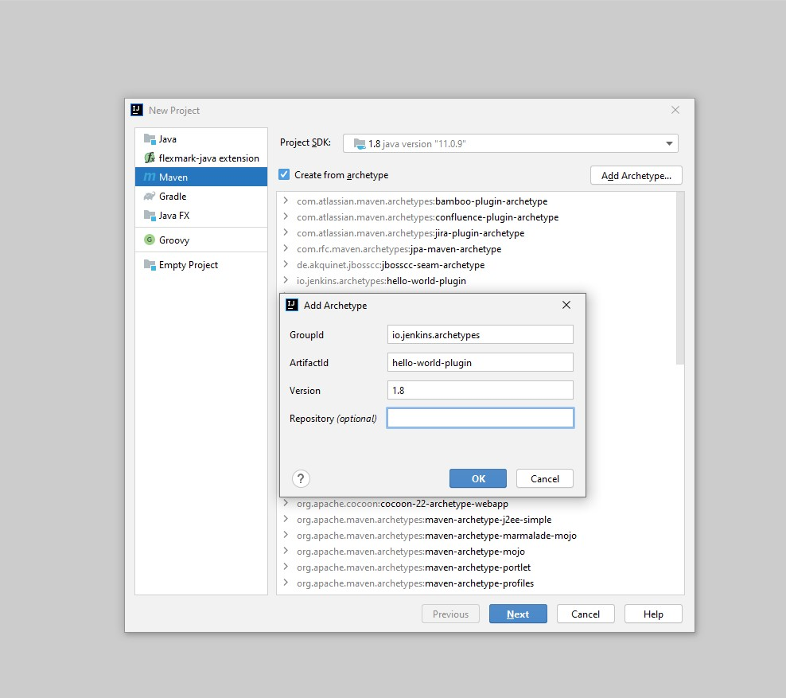
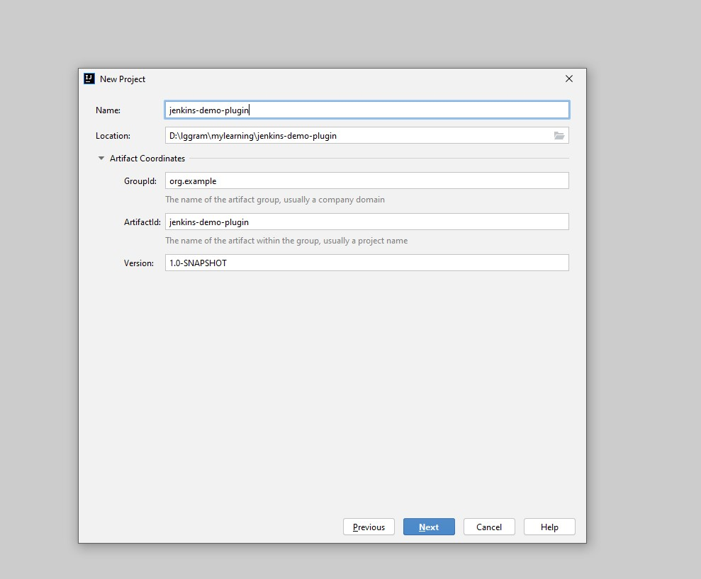
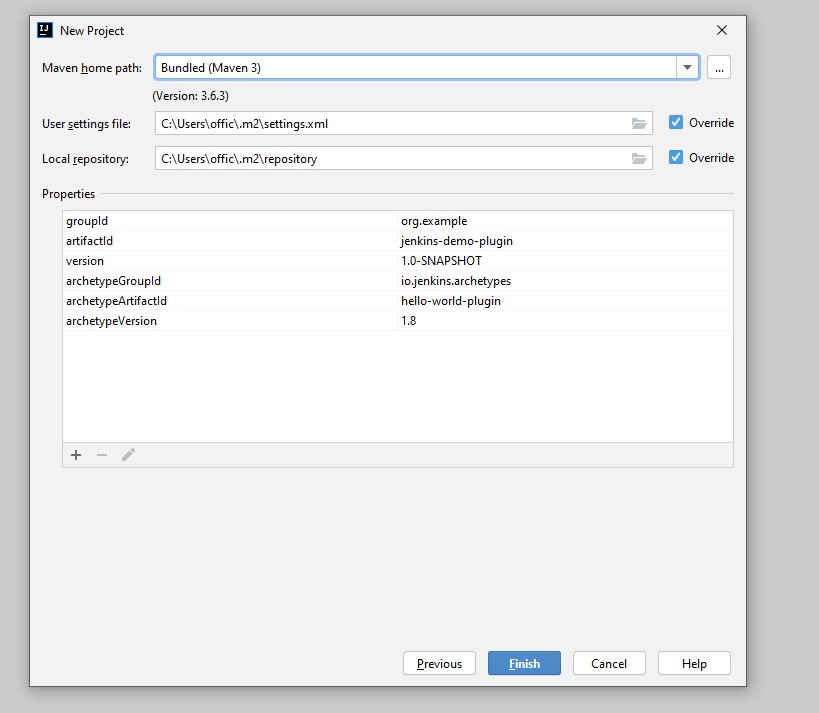
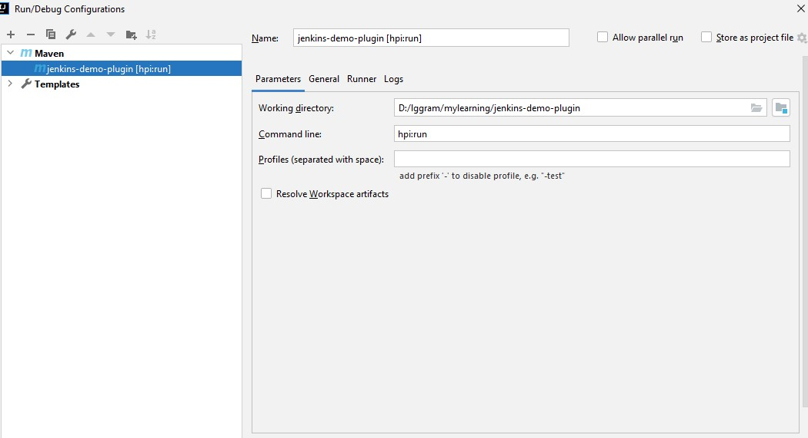
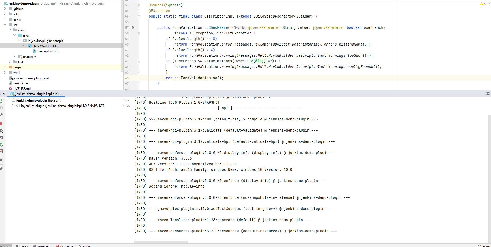
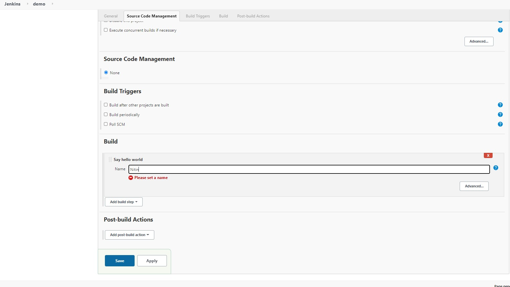
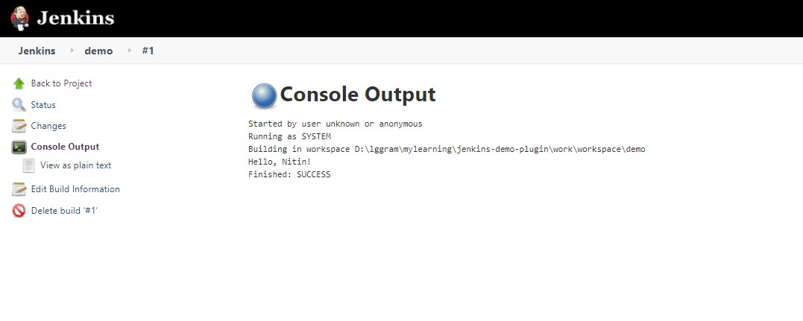

# Jenkins Creation of Shared Library

Reference doc: https://www.jenkins.io/doc/developer/tutorial/prepare/ 

Note: You can directly clone https://github.com/nitinjain9282/jenkins-demo-plugin/tree/1.0.0_initial_hello_plugin_jenkins and run plugin development
environment preparation.

### Preparing for plugin development
1. IntelliJ Idea => New Project => Maven => Create from archetypes

2. 






3. Once project is build successfully if we are getting following error: 
``` 
"Messages cannot be resolved error when imported Jenkins plugin as Maven project"
```

Make sure you have maven settings correct. In my case using Maven bundled and overriding setting.xml helped.

```xml
 <profiles>
    <!-- Give access to Jenkins plugins -->
    <profile>
      <id>jenkins</id>
      <activation>
        <activeByDefault>true</activeByDefault> <!-- change this to false, if you don't like to have it on per default -->
      </activation>
      <repositories>
        <repository>
          <id>repo.jenkins-ci.org</id>
          <url>https://repo.jenkins-ci.org/public/</url>
        </repository>
      </repositories>
      <pluginRepositories>
        <pluginRepository>
          <id>repo.jenkins-ci.org</id>
          <url>https://repo.jenkins-ci.org/public/</url>
        </pluginRepository>
      </pluginRepositories>
    </profile>
  </profiles>
```

4. Add maven configuration for project run src/main/java/io/jenkins/plugins/sample/HelloWorldBuilder.java

```
hpi:run
```



5. Next, we can start project and will see following logs: 



6. login to  http://localhost:8080/jenkins/
7. New Item => create freestyle project => Add build step => say hello



8. Run build 



