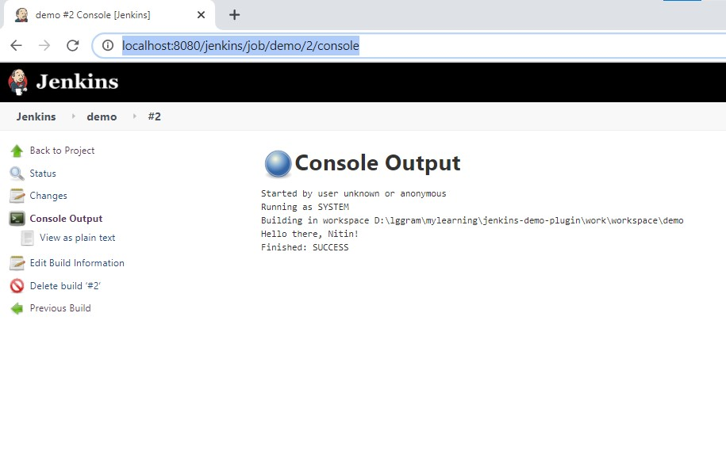

- we will make small change to src/main/java/io/jenkins/plugins/sample/HelloWorldBuilder.java 

```
@Override
    public void perform(Run<?, ?> run, FilePath workspace, Launcher launcher, TaskListener listener) throws InterruptedException, IOException {
        if (useFrench) {
            listener.getLogger().println("Bonjour, " + name + "!");
        } else {
            listener.getLogger().println("Hello, " + name + "!");
        }
    }
```

t0

```
@Override
    public void perform(Run<?, ?> run, FilePath workspace, Launcher launcher, TaskListener listener) throws InterruptedException, IOException {
        if (useFrench) {
            listener.getLogger().println("Bonjour, " + name + "!");
        } else {
            listener.getLogger().println("Hello there, " + name + "!");
        }
    }
```

- mvn hpi:run => This will compile the code (after picking up our modification), and then start up and run a local instance of Jenkins on your machine with our newly updated plugin already deployed to it—this makes the testing of your changes much easier, quicker, and safer too.

- http://localhost:8080/jenkins/ 

- 
