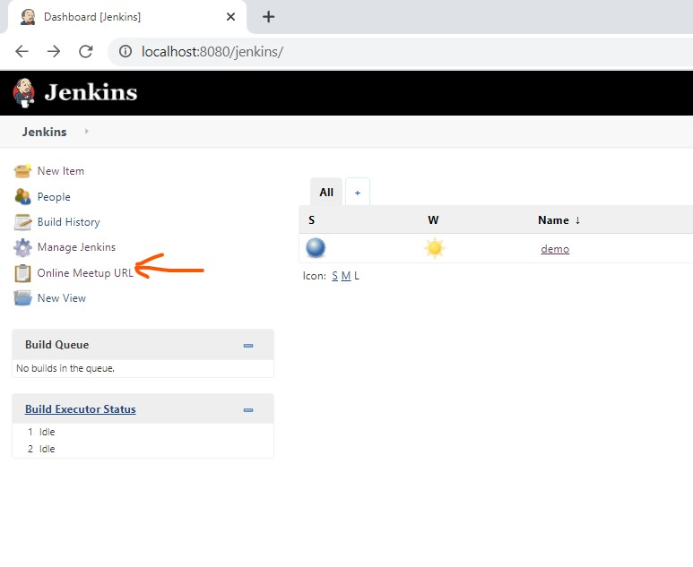

- Start from here: https://github.com/nitinjain9282/jenkins-demo-plugin.git
-  Add following class:

```java
package io.jenkins.plugins.sample;


import hudson.Extension;
import hudson.model.RootAction;

@Extension // it will add current list of Root Actions.
public class OnlineRootAction  implements RootAction {


    @Override
    public String getIconFileName() {
        return "clipboard.png";
    }

    @Override
    public String getDisplayName() {
        return "Online Meetup URL";
    }

    @Override
    public String getUrlName() {
        return "http://www.google.com";
    }
}

```

- mvn hpi:run OR run directly from IntelliJ 

- it will bring up following Action on the screen: 




