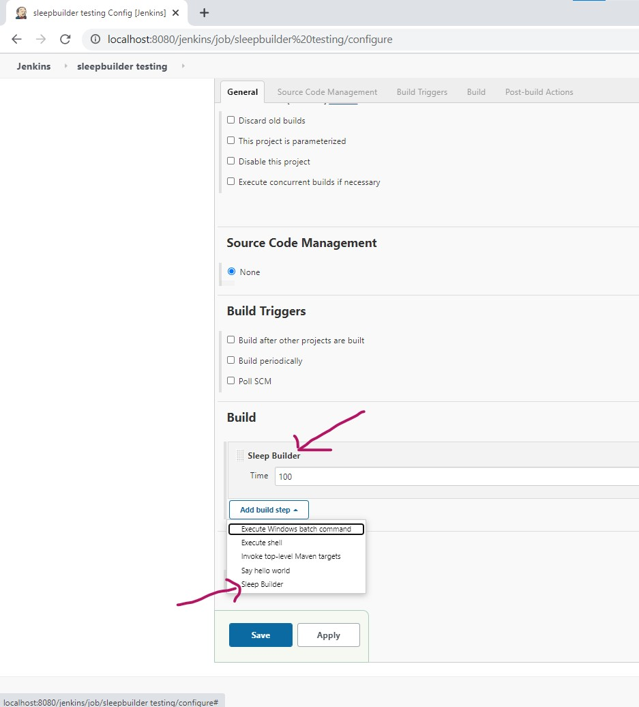
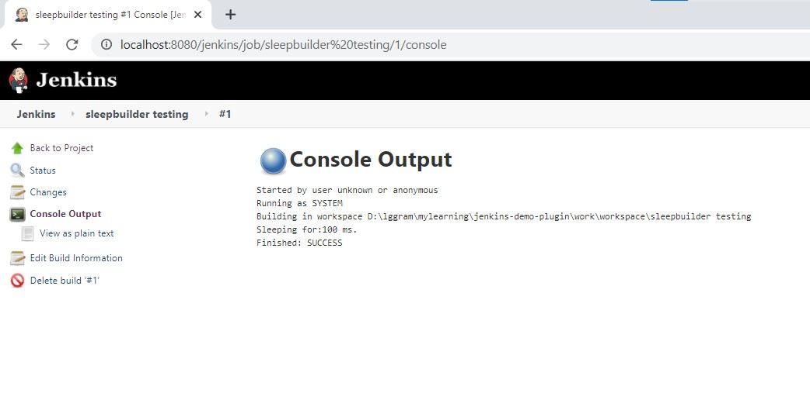

#### Creating new build step called Sleep Builder which trigger job to sleep for certain time. 

- Start from here: https://github.com/nitinjain9282/jenkins-demo-plugin.git
-  Added src/main/java/io/jenkins/plugins/sample/SleepBuilder.java

1. 

```java
public class SleepBuilder extends Builder {
    private long time;

    @DataBoundConstructor
    // we want to set time in a field in builder to go to sleep for certain time
    // tell jenkins to enter field and give a value
    public SleepBuilder(long time){
      this.time = time;
    }

    public long getTime() {
        return time;
    }

    public void setTime(long time) {
        this.time = time;
    }

    @Override
    public boolean perform(Build<?, ?> build, Launcher launcher, BuildListener listener) throws InterruptedException, IOException {
         Thread.sleep(time);
         return true;
    }
}
```
- Created Builder class, actual instantiation of it will be done by DescriptorImpl
- actual implementation is always done in perform method.

2. 

```
<?jelly escape-by-default='true'?>
<j:jelly xmlns:j="jelly:core" xmlns:st="jelly:stapler" xmlns:d="jelly:define" xmlns:l="/lib/layout" xmlns:t="/lib/hudson" xmlns:f="/lib/form">
    <f:entry title="Time" field="time">
        <f:textbox />
    </f:entry>

</j:jelly>
```
- src/main/resources/io/jenkins/plugins/sample/Sleepbuilder/config.jelly
- this maps "time" field to label "Time".

3.  

```java
@Extension
    public static final class DescriptorImpl extends BuildStepDescriptor<Builder> {

        @Override
        public boolean isApplicable(Class<? extends AbstractProject> aClass) {
            return aClass == FreeStyleProject.class;  // applicable for freestyle project only.
        }

        @NonNull
        @Override
        public String getDisplayName() {
            return "Sleep Builder"; //title for it
        }
    }
```

- here we override two methods 
- (1) getDisplayName which will display Sleep Builder label. 
- (2) isApplicable which tells Jenkins which project this step will be Applicable 
- Add @Extension here to register this step to Jenkins.


4. - mvn hpi:run OR run directly from IntelliJ 
   
5.  
  



