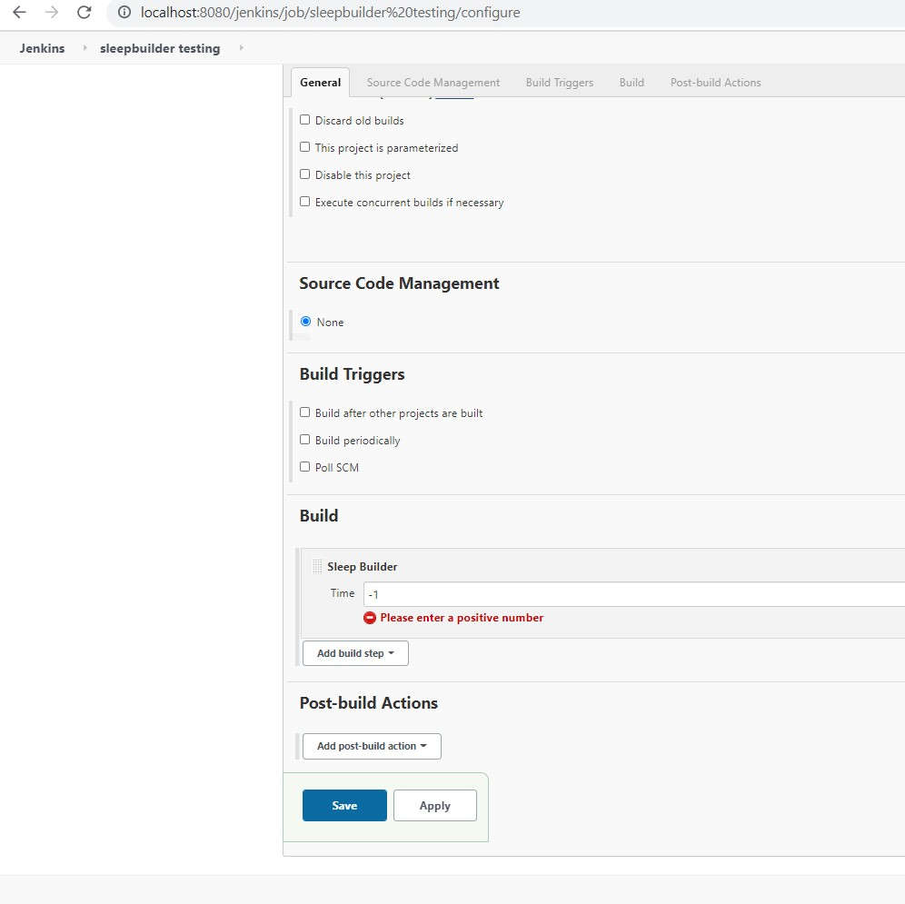
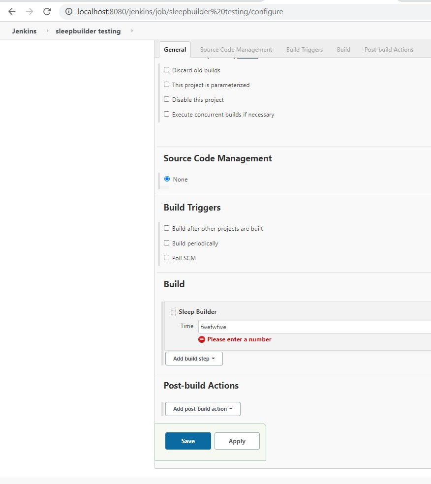

#### Continue from step 5.2.0_SleepBuilder_action_1.md

- Adding Validator for **time** so that it doesn't allow text to be entered in field. 

```
 public FormValidation doCheckTime(@QueryParameter String time){

             try {
                 if (Long.valueOf(time) < 0) {
                     return FormValidation.error("Please enter a positive number");
                 }
                 else {
                     return FormValidation.ok();
                 }
             }catch (NumberFormatException e) {
                return FormValidation.error("Please enter a number");

             }

        }
```

- Note that in doCheckTime Time is field defined in index.jelly. Refer here : https://www.jenkins.io/doc/developer/forms/form-validation/ 

-  Rerun the build and test as follows:






