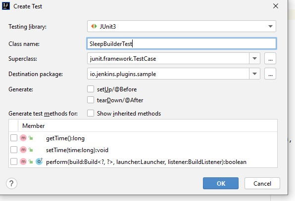

- go to src/main/java/io/jenkins/plugins/sample/SleepBuilder.java => Right Click => Generate => Test 




- Added test here:src/test/java/io/jenkins/plugins/sample/SleepBuilderTest.java

```java
package io.jenkins.plugins.sample;

import hudson.model.FreeStyleBuild;
import hudson.model.FreeStyleProject;
import jenkins.model.Jenkins;
import junit.framework.TestCase;
import org.junit.Rule;
import org.junit.Test;
import org.jvnet.hudson.test.JenkinsRule;

import java.io.IOException;
import java.util.concurrent.ExecutionException;

public class SleepBuilderTest extends TestCase {

    @Rule
    public JenkinsRule r = new JenkinsRule();

    // we will be checking console output messages for SleepBuilder
    @Test

    public void checkSleepOutput() throws IOException, ExecutionException, InterruptedException {
        //Given
        long time = 12;
        SleepBuilder builder = new SleepBuilder(time); // Creating Sleepbuilder and passing necessary parameter
        FreeStyleProject p = r.createFreeStyleProject(); // With Jenkins rule we can create new FreeStyle Project
        p.getBuildersList().add(builder);  // Next we need to add builder to this project.

        //When

        FreeStyleBuild freeStyleBuild=  p.scheduleBuild2(0).get(); // when we schedule a new build with 0 second, get() will return FreeStyleBuild

        //Then

        assertTrue(freeStyleBuild.getLog().contains("Sleeping for: " + time +" ms. ")); // Ensuring this FreeStyleBuild returns given output

    }


}
```
